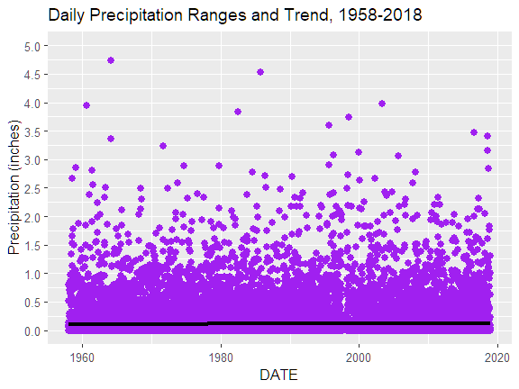

# HotWater

## Background

Average global temperatures have increased around 2 °F over the past 100 years (https://climate.nasa.gov/vital-signs/global-temperature/).  Wider variations in local temperature extremes and annual precipitation amounts have accompanied the climate change.  Both climate change and its impact are considered within the municipal Cincinnati area.  

Cincinnati received a citation from the Environmental Protection Agency requiring remediation of the city's storm water runoff system.  During periods of extreme rainfall, storm water can exceed processing capacity, which results in mixtures of raw sewage and waste water overflowing into the natural watershed.  A multi-year project seeks to increase handling capacity during major rain storms.  Accurate forecasting of maximum rainfall amounts expected over the next century is required to ensure that the public project adequately protects the environment without incurring costs from overestimating required changes.  In the near term, climate change impacts progress due to worker restrictions during extreme heat and cold.  

## Data and Analysis
Daily temperature extremes and observed precipitation amounts from Cincinnati's Lunken Field Municipal Airport were analyzed between 1958 and 2018 based on data maintained by the National Centers for Environmental Information.  Regression and visual analysis were performed in R.

## Precipitation Analysis and Impact

Consistent Number of Rain Days  

Heavy Rain Days Result in Sewer Overflows
- Sewer design must account for normal high rainfall
- Overflows on days with more than 0.5" rainfall
- Acknowledge occurrence of multi-year highs
No Trend in Heavy Rain Days
- Heavy rain days:
    - limit remediation schedule
    - Impact combined sewer overflow occurrences
- Number of heavy rain days not increasing
- Expect median 16 rain days (11-18) per year

No Trend in Heavy Rain Days
========================================================
- Sewer capacity should consider observed maxima
- Infrequent occurrences of 2" rainfall / day
- Median heavy day rainfall under 1"

Consistent Days Between Heavy Rainfall
========================================================

- Consecutive  rain days of rain prevent sewers from returning to baseline capacity 
- Increase the likelihood of an overflow event

## Temperature Analysis and Impact

- Temperatures above 100 Deg. F occurred in June - August
- Cooling facilities for crews on hot days
- Equipment maintenance challenges

- No statistical change in number of days above 100  Deg. F

Consistent Number of Freezing Days
- Freezing days increase potential for water line breakage
- Number of lowest temperature days decreasing

## Limitations of Analysis

## Conclusion

Complete Projects as Planned with Expected Weather Interruptions
- Steady temperature change without heavy impact from variation
- No expected changes in rainfall amounts 
- Yearly high and low temperatures permit consistent working conditions
- Monitor changes in trends throughout the decade

## Works Cited

National Centers for Environmental Information (n.d.)  https://www.ncdc.noaa.gov/cdo-web/.  Accessed 4/13/2022.

Metropolitan Sewer District of Greater Cincinnati & Hamilton County (2017, July).  Q2 2017 Consent Decree Report.  https://projectgroundwork.org/downloads/consentdecreequarterly/CD_Q2_2017.pdf.  Accessed 4/24/2022.

Metropolitan Sewer District of Greater Cincinnati & Hamilton County. (2001, March)  Rules and regulations governing the design, construction, maintenance, and use of sanitary and combined sewers.  https://www.msdgc.org/downloads/about_msd/msd-rules-regulations/rules_and_regulations.pdf.  

Occupational Safety and Health Administration. (2017, September).  OSHA technical manual section III: chapter 4.  Heat stress.  https://www.osha.gov/otm/section-3-health-hazards/chapter-4.  Accessed 4/29/2022.

