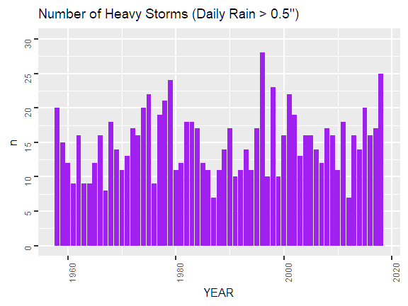
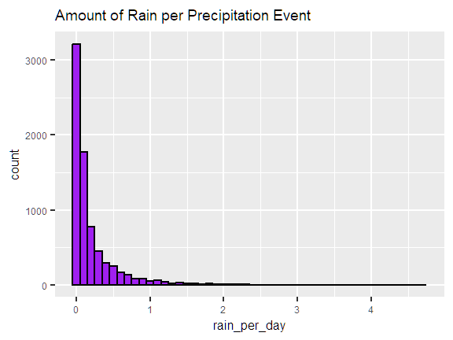
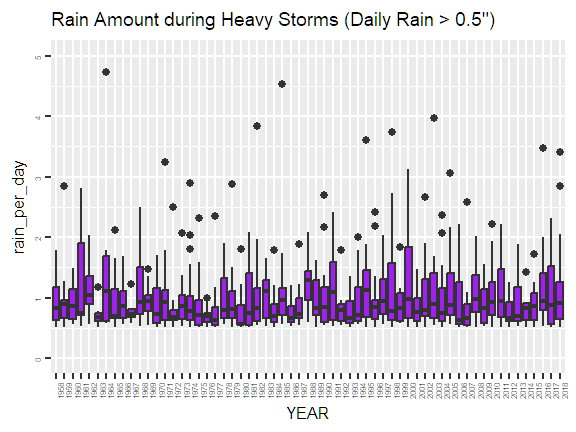
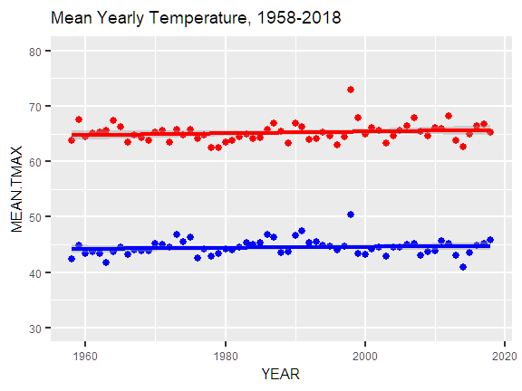
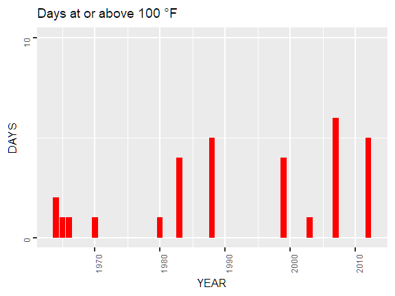
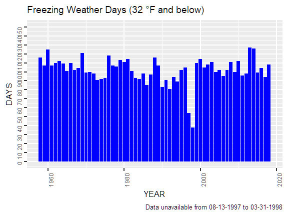
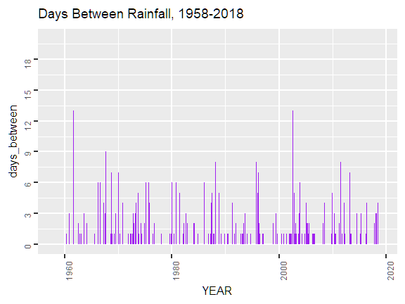

# HotWater

## Background

Average global temperatures have increased around 2 °F over the past 100 years (https://climate.nasa.gov/vital-signs/global-temperature/).  Wider variations in local temperature extremes and annual precipitation amounts have accompanied the climate change.  Both climate change and its impact are considered within the municipal Cincinnati area.  

Cincinnati received a citation from the Environmental Protection Agency requiring remediation of the city's storm water runoff system.  During periods of extreme rainfall, storm water can exceed processing capacity, which results in mixtures of raw sewage and waste water overflowing into the natural watershed.  A multi-year project seeks to increase handling capacity during major rain storms.  Accurate forecasting of maximum rainfall amounts expected over the next century is required to ensure that the public project adequately protects the environment without incurring costs from overestimating required changes.  In the near term, climate change impacts progress due to worker restrictions during extreme heat and cold.  

## Data and Analysis
Daily temperature extremes and observed precipitation amounts from Cincinnati's Lunken Field Municipal Airport were analyzed between 1958 and 2018 based on data maintained by the National Centers for Environmental Information.  Regression and visual analysis were performed in R.

## Precipitation Analysis and Impact

Sewer design must handle normal rainfall as per the [Cincinnati Metropolitan Sewer District Rules and Regulations](https://www.msdgc.org/downloads/about_msd/msd-rules-regulations/rules_and_regulations.pdf).  Additionally, stormwater detention should factor in the impact of development on runoff and differences between a once in 10 or 25 year storms.  Per district figures, these storms could produce between 2 and 2.4 inches of rain per hour.       [Annual progress reports](https://projectgroundwork.org/downloads/consentdecreequarterly/CD_Q2_2017.pdf) noted that sewer overflows occurred on days with more than 0.5" rainfall.  Therefore, rainfall analysis separately considers heavy rainfall amounts greater than a half inch per day as a separate event.  

Practically, the number of total and heavy rain days appears consistent between 1958 and 2018.  This is important because while rain days may limit the construction schedule, heavy rain days may cause sewer overflows.  

Considering rain amounts, while most rainy days involve less than a half inch of rain, severe rains between two and five inches have occurred. Each year, a median of 16 (between 11 - 18) heavy downpours are expected based on regression of the heavy rainfall amounts.  Heavy rainfall under 1" per day are expected, while limited storms producing more than two inches may occur.  Over the next 100 years, heavy rainfalls between 4 to 5 inches may occur.  While the predictive regression suggests that maximum rainfall will increase, there is a wide amount of uncertainty in the maximum predicted amount due to historical variance.  However, these predictions may inform a safety factor for the overall sewer capacity design.   

## Temperature Analysis and Impact

Temperature extremes arising from climate change may impact the immediate working environment during construction projects.  Per the Occupational Safety and Health Administration (OSHA), cooling facilities must be provided for crews on hot days, and additional limitations may be placed on shift lengths.  While OSHA does not maintain a specific standard for cold weather work, it recognizes that cold weather risks such as frostbite and hypothermia are general hazards from which employers should provide protection.  Further, extreme temperatures may present a maintenance challenge for construction and waste processing equipment.  

Cincinnati temperatures have increased around 1 °F over the past 50 years.  This is aligned with common estimates for world temperature increases.  For hot weather, temperatures above 100 °F occurred in June - August.  However, no trends are observed for the number of these extreme temperature days.  

For cold weather, December to February have median low temperatures below freezing.  Days below freezing have occurred as early as October and as late as May.  In general, the number of days with below freezing temperatures has remained constant, while the overall number of days with subzero temperatures has decreased.  

## Limitations of Analysis
Without understanding processing capacity, the analysis did not consider the impact of consecutive rainy days on sewers returning to a baseline capacity.  Therefore, total rainfall over a period of multiple days could be a potential factor in sewer design.  

Second, rainfall amounts are taken from a single representative location.  Amounts may vary across the city.  Further, impermeable surfaces may impact the amount of runoff presented to a stormwater catchment, while permeable surfaces such as lawns and landscaping may decrease the amount of runoff. 

Last, sewer capacity calculations consider hourly rates of rainfall.  Because the NOAA dataset presented daily values, it was impossible to determine the rate at which rainfall occurred.  Predictions based on the daily rainfall are a surrogate for hourly measurements.

## Conclusion

Wastewater projects should be completed as planned based on current estimates of precipitation and temperature extremes.  No expected changes in rainfall amounts are expected, and yearly high and low temperatures permit consistent working conditions.  Regional climate change trends should be monitored throughout the following decades for impact to the system.  Last, rainfall predictions should be revisited using hourly rainfall measurements.  

## Works Cited

National Centers for Environmental Information (n.d.)  https://www.ncdc.noaa.gov/cdo-web/.  Accessed 4/13/2022.

Metropolitan Sewer District of Greater Cincinnati & Hamilton County (2017, July).  Q2 2017 Consent Decree Report.  https://projectgroundwork.org/downloads/consentdecreequarterly/CD_Q2_2017.pdf.  Accessed 4/24/2022.

Metropolitan Sewer District of Greater Cincinnati & Hamilton County. (2001, March)  Rules and regulations governing the design, construction, maintenance, and use of sanitary and combined sewers.  https://www.msdgc.org/downloads/about_msd/msd-rules-regulations/rules_and_regulations.pdf.  

Occupational Safety and Health Administration. (2017, September).  OSHA technical manual section III: chapter 4.  Heat stress.  https://www.osha.gov/otm/section-3-health-hazards/chapter-4.  Accessed 4/29/2022.

